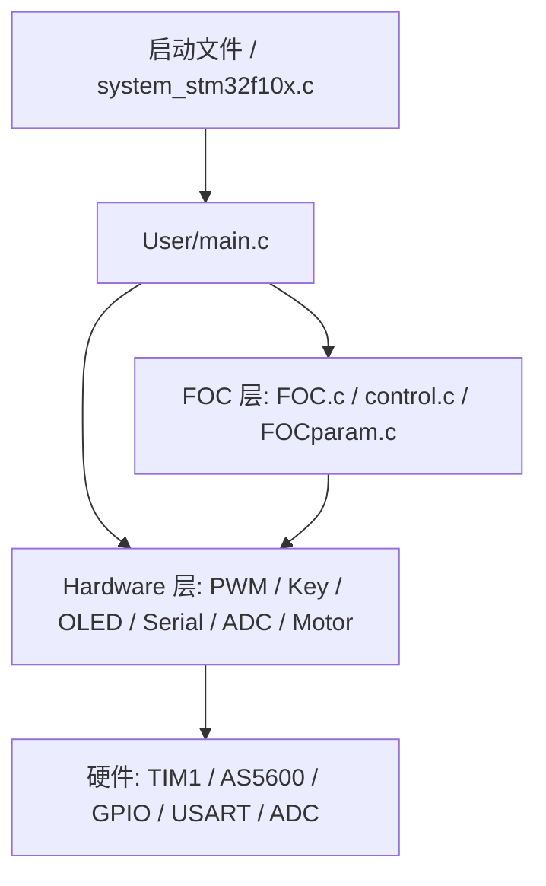

# 项目架构说明

## 目标

这个项目是一个基于 STM32F103 的无刷电机 FOC 控制工程，包含启动初始化、传感器采样、闭环控制、PWM 输出和人机交互。

## 总体分层

## 目录职责

### `User/`

应用入口和系统调度。

- `main.c`：系统初始化、10ms 调度、按键分发、屏幕刷新、串口调试输出。
- `main.h`：应用层全局状态与任务接口声明。

### `FOC/`

电机控制核心逻辑。

- `FOC.c`：电角度计算、SVPWM 生成、FOC 输出控制。
- `control.c`：角度环和速度环 PID 控制。
- `field_weakening.c` / `field_weakening.h`：弱磁控制调度层，负责在高转速或电压接近上限时注入负 d 轴电压。
- `FOCparam.c` / `FOCparam.h`：FOC、SVPWM 和 PID 参数结构体及默认参数初始化。

#### 参数层说明

- `PID`：保存位置环和速度环的目标值、反馈值、误差、积分和输出限幅。
- `FOC`：保存母线电压、零电角、目标角度 / 速度、反馈角度 / 速度以及电机方向参数。
- `SVPWM`：保存 PWM 周期、扇区、三相作用时间和最终比较值，用于驱动 TIM1。

### `Hardware/`

板级硬件驱动与外设封装。

- `PWM.c`：TIM1 三相 PWM 初始化与比较值写入。
- `Key.c`：ADC 按键扫描，区分短按和长按。
- `Motor.c`：电机方向引脚与 PWM 输出封装。
- `AS5600.c`：磁编码器接口。
- `MPU6050.c` / `MPU6050.h`：MPU6050 传感器初始化与寄存器读写，复用现有 `MyI2C` 总线。
- `MPU6050` 目前挂在现有软件 I2C 总线上，SCL/SDA 由 `MyI2C.c` 管理，适合和 AS5600 共线使用。
- `OLED.c` / `Serial.c` / `ADC.c`：显示、串口和模拟量采集。

### `Library/`

STM32 标准外设库相关实现。

### `Start/`

芯片启动与系统时钟配置。

## 运行流程

1. 上电后进入启动文件，完成跳转到 `SystemInit()`。
2. 系统时钟配置完成后进入 `User/main.c` 的 `main()`。
3. `Bsw_Init()` 完成底层外设初始化。
4. `FOCPARAM_init()` 和 `SVPWMPARAM_init()` 初始化控制参数。
5. 主循环持续执行：
   - `task_10ms()`：控制环计算、角度/速度采样、SVPWM 输出。
   - `KeyDeal()`：更新目标值和 PID 参数。
   - `OLEDDeal()`：刷新调试面板。
   - `LEDDeal()`、`ADCDeal()`：辅助状态处理。

## 当前控制链路

- 位置/速度目标值由按键修改。
- `FOC_Parame` 保存当前目标值、传感器值和控制开关状态。
- `Set_Angle()` 先把角度误差转换成速度目标值，属于位置环。
- `Set_Speed()` 再把速度误差转换成 `Uq`，属于速度环。
- `FieldWeakening_Process()` 在速度环输出后决定是否注入负 `Ud`，再交给 `SVPWM_Generate()`。
- `SVPWM_Generate()` 把 `Ud/Uq` 和电角度转换成三相 PWM 比较值。
- `setPWM()` / `PWM_SetCompare*()` 负责最终写入定时器寄存器。

## 弱磁控制架构

1. 速度环仍然负责输出 `Uq`，保持现有闭环行为不变。
2. 弱磁层读取目标速度、反馈速度和当前 `Uq`，判断是否接近电压上限。
3. 当进入弱磁区间时，模块生成负 `Ud`，为高速区保留更多反电动势裕量。
4. 调制层接收 `Ud/Uq` 双轴指令，并统一转换为 SVPWM 三相占空比。

## 控制层关系

1. 位置环输出不是直接驱动电机，而是给速度环提供目标值。
2. 速度环输出的是力矩电压 `Uq`，它决定最终电机输出强度。
3. `SVPWM` 负责把 `Uq` 按当前电角度分配到三相桥臂上。

## 建议的整理方向

1. 继续把应用层状态集中到单一模块，减少头文件里的全局定义。
2. 给每个模块补一段“职责说明”和“输入 / 输出”注释。
3. 把调试打印、OLED 显示和控制计算进一步拆开，避免 `main.c` 继续膨胀。
4. 后续可以把按键、PID、FOC 参数整理成独立结构体，进一步减少散落的全局变量。